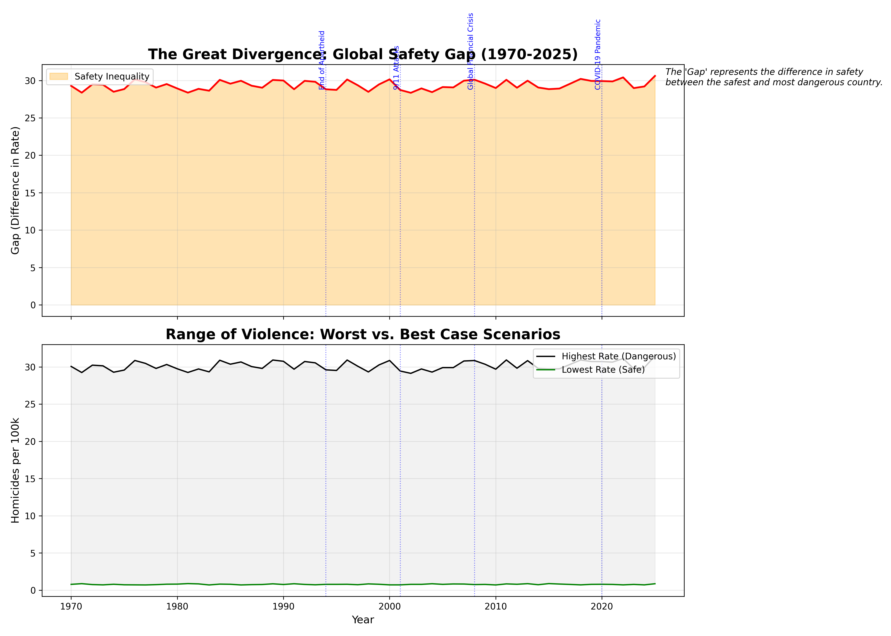
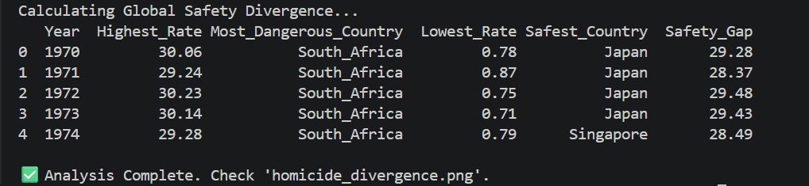

# 📉 The Great Divergence: Global Safety Inequality (1970-2025)

A data visualization project analyzing the gap between the world's safest and most dangerous nations over a 55-year period.

## 📊 Project Overview

While average global homicide rates may fluctuate, this project investigates the _inequality_ of safety. By calculating the annual difference between the highest and lowest homicide rates, we determine if the world is becoming more equal in terms of safety or if the gap between safe and dangerous nations is widening.

## 📈 Dataset

-   **Source:** UNODC & Our World in Data.
-   **Scope:** 13 Countries.
-   **Timeframe:** 1970 – 2025.

## 🛠️ Methodology

1.  **Annual Extremes:** Identified the country with the maximum and minimum homicide rate for every single year from 1970 to 2025.
2.  **Gap Calculation:** Computed the `Safety Gap` (Max Rate - Min Rate) for each year.
3.  **Comparative Visualization:** Created a dual-axis plot showing the divergence over time, annotated with major global historical events.

## 🚀 Key Findings

-   **Persistent Inequality:** The "Safety Gap" has remained remarkably stable around **29.0** for over 50 years. Despite technological and social advancements, the disparity between the safest nations (Japan/Singapore, <1.0) and the most dangerous (South Africa, ~30) has not narrowed.

  
-   **The "Dangerous" Anchor:** South Africa has been the consistent "Most Dangerous" country in this dataset for the entire duration.

-   **The "Safe" Anchor:** Japan and Singapore have alternated as the "Safest" country, maintaining rates consistently below 1.0.

## 📁 Files Included

-   `homicide_divergence.py`: Script for divergence calculation and visualization.
-   `homicide_divergence.png`: A dual-panel chart showing the Safety Gap over time and the min/max range of violence.

## 🏃 Running the Project

1.  Ensure `Global_Homicide_Rate_1970_2025.csv` is in the folder.
2.  Run the script: `python homicide_divergence.py`
